<h1 align="center">Hi, I'm Daniel Godri Neto! 👋</h1>
<h3 align="center">Game Dev · Full Stack · Tinkerer</h3>

 

<table align="center">
  <tr>
    <td valign="top" width="55%">
      <h3> Sobre mim</h3>
      

        Apaixonado por tecnologia e jogos, curto criar <strong>mods para games</strong> e explorar o que dá pra fazer além do que os desenvolvedores planejaram. 
      

      

        Gosto de trabalhar em <strong>projetos variados</strong>  desde ferramentas úteis até experimentos malucos, sempre aprendendo algo novo no processo. 
      

      

        Também desenvolvo <strong>projetos da faculdade</strong>, colocando em prática o que aprendo e transformando trabalhos acadêmicos em código de verdade. 
      

       
      

        
        
        
      

    </td>
    <td valign="top" align="right" width="45%">
      
    </td>
  </tr>
</table>

 

---

<h3 align="center">🛠️ Technologies & Tools</h3>

  
  
  
  
  
  
  
  
  
  
  
  
  
  
  
  
  
  
  
  
  
  
  
  
  
  
  

 

---

<h3 align="center">Contador de views</h3>

  
    
  

 

---

<h3 align="center">📁 Projects</h3>

  

 

---

