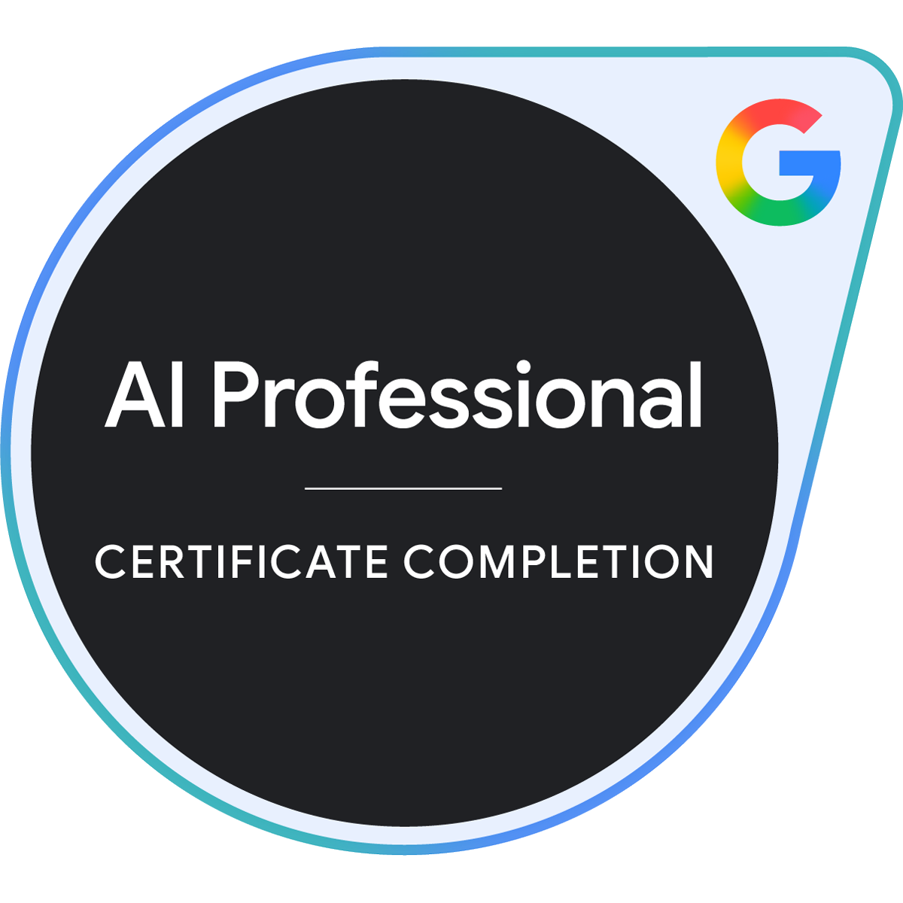
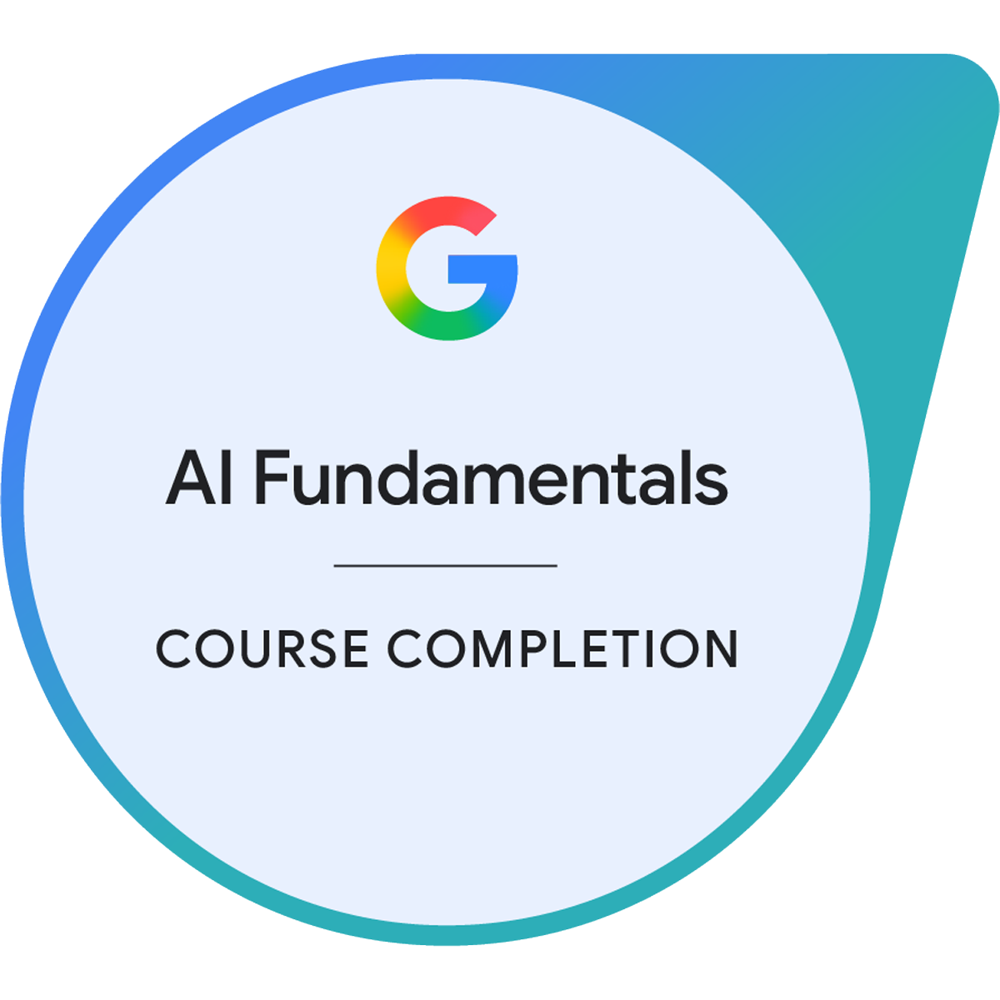
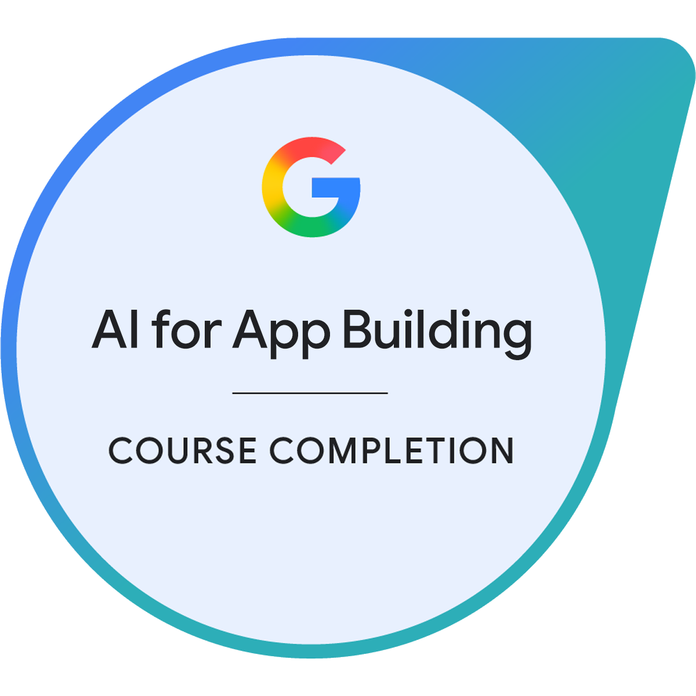
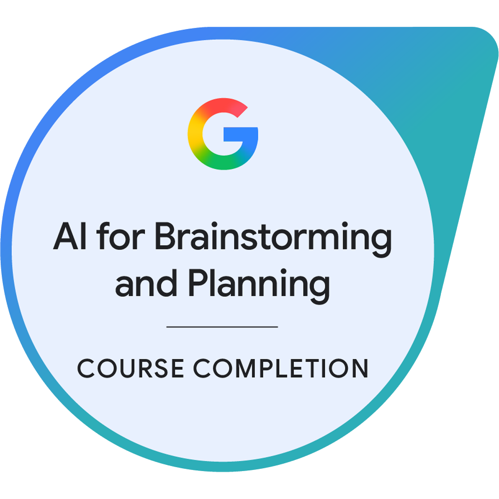
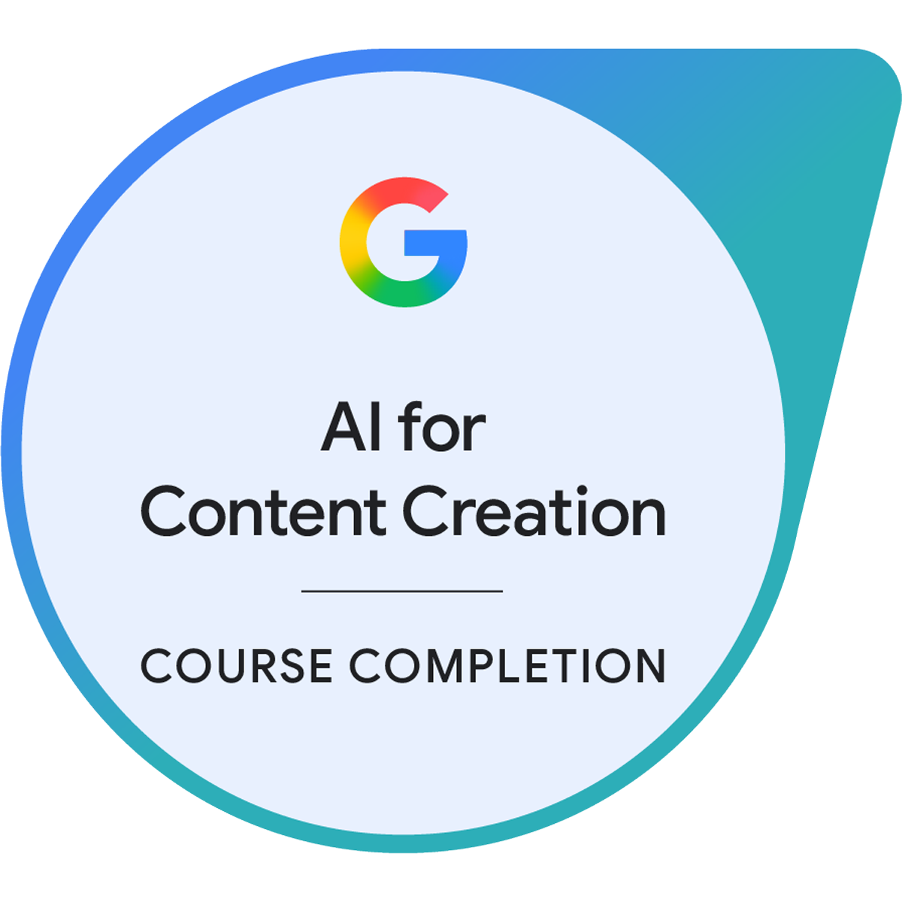
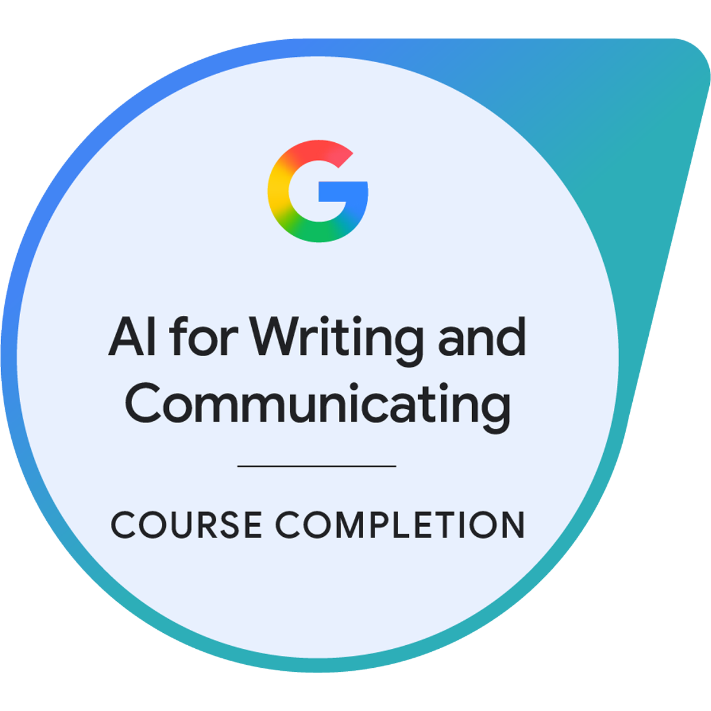
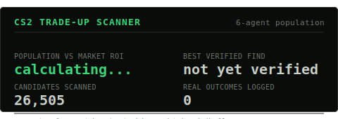

  <h1>Hi, I'm Daniel Godri Neto! 👋</h1>
  
<strong>Game Developer • Full Stack Engineer • AI Enthusiast</strong>

  

    
    
    
  

 

## 🚀 Sobre Mim

Apaixonado por tecnologia, desenvolvimento de jogos e inteligência artificial[cite: 1]. Tenho foco em criar **mods para games**, explorar engenharia reversa e construir ferramentas que expandem as possibilidades originais dos softwares[cite: 1].

- 🛠️ **Projetos Variados:** Desenvolvimento de ferramentas úteis, automações e experimentos práticos[cite: 1].
- 🎓 **Foco Acadêmico:** Transformando conceitos teóricos da faculdade em aplicações reais e código de produção[cite: 1].
- 🧠 **Especialização:** Aplicando IA para otimização de fluxos de trabalho e engenharia de software[cite: 1].

 

## 🏆 Certificações em Destaque

  
<strong>Google AI Professional Certificate</strong>

  
  
   
  
<small>Especializações Concluídas</small>

  
  <!-- Grid Responsivo de Sub-certificações -->
  
  
  
  
  
  
  

 

## 🛠️ Tecnologias & Ferramentas

  

 

## 📊 Estatísticas do GitHub

  

 

## 🎮 Projetos em Destaque

<!-- Renderização nativa pura do Markdown: elimina distorções de proporção e mantém o corte perfeito do SVG original -->

  

 

---

  <!-- Analytics discreto no rodapé -->
  

    
    &nbsp;&nbsp;&nbsp;&nbsp;
    
  

  <!-- Animação final da cobrinha ocupando a base de forma limpa -->
  

